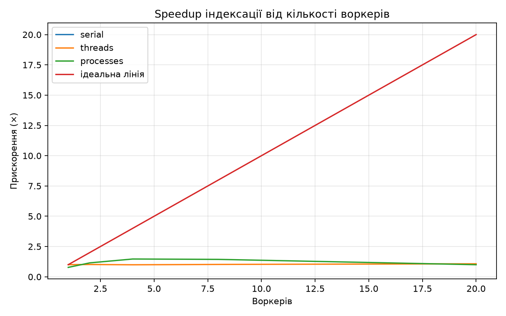

# findex — лабораторні роботи 1–5

[](https://github.com/dfsgotl-lenya/findex/actions/workflows/ci.yml)
[](https://sonarcloud.io/summary/new_code?id=dfsgotl-lenya_findex)

Навчальний пошуковий рушій `findex`, який поступово розширюється протягом курсу Python.


## Лабораторна робота №1

**Тема:** ітератори, генератори та корпус текстів.

Реалізовано `iter_documents()`, потоковий `tokenize()` з Unicode NFC та `casefold()`, однопрохідну статистику, `--limit`, `tracemalloc` і порівняння lazy/eager.

## Лабораторна робота №2

**Тема:** інвертований індекс, словники, хешування та пам'ять.

Реалізовано `Posting`/`DocMeta` через `@dataclass(frozen=True, slots=True)`, інвертований індекс через `defaultdict`, Boolean-пошук `AND/OR/NOT`, двигуни `merge/set`, `pickle` + `JSON` та порівняння `plain/slots/array('I')`.

### Результати Lab 2

#### Merge vs set

| Терм | Група | Двигун | Результатів | Загальний час (с) | Середній час (мс) |
|---|---|---|---:|---:|---:|
| токен | common | merge | 300 | 0.000959 | 0.0048 |
| токен | common | set | 300 | 0.000969 | 0.0048 |
| пошук | common | merge | 300 | 0.000998 | 0.0050 |
| пошук | common | set | 300 | 0.000950 | 0.0047 |
| raretoken0001 | rare | merge | 1 | 0.000193 | 0.0010 |
| raretoken0001 | rare | set | 1 | 0.000205 | 0.0010 |
| raretoken0002 | rare | merge | 1 | 0.000200 | 0.0010 |
| raretoken0002 | rare | set | 1 | 0.000201 | 0.0010 |

#### Серіалізація

| Формат | Розмір (MiB) | Save (с) | Load (с) |
|---|---:|---:|---:|
| pickle | 0.26 | 0.020832 | 0.018150 |
| JSON | 0.41 | 0.033599 | 0.013174 |

#### Пам'ять

| Варіант | Документи | Пікова пам'ять (MiB) | Розмір pickle (MiB) | Save (с) | Load (с) |
|---|---:|---:|---:|---:|---:|
| plain | 300 | 2.39 | 0.31 | 0.010769 | 0.006774 |
| slots | 300 | 1.72 | 0.24 | 0.018702 | 0.015783 |
| array | 300 | 0.90 | 0.15 | 0.001073 | 0.000246 |

`slots=True` прибирає окремий `__dict__` екземпляра, а `array('I')` зберігає числові значення щільніше, без окремого Python-об'єкта для кожного числа.

## Лабораторна робота №3

**Тема:** рейтинг і модель об'єктів — dunder-методи, протоколи, декоратори.

Лабораторна продовжує корпус і індекс з перших двох робіт. Вимоги: `Index` як Python-подібний об'єкт, `Scorer` з TF-IDF/BM25, дерево Boolean-запитів, контекстний менеджер, `@timed`, `lru_cache`, сніпети та P@5. Джерело: [методичка Lab 3](https://github.com/rmalkevy/Programming-Practice-Projects/blob/main/courses/python/lab-03-the-object-model-and-ranking.md).

### 1. Об'єкт `Index`

Підтримуються:

```python
len(index)
"python" in index
index["python"]
for term in index:
    ...
repr(index)
index.num_docs
index.avg_doc_length
index.doc_length(doc_id)
index.df(term)
```

`Index` реалізує `collections.abc.Mapping`. `avg_doc_length` є `cached_property`. `open_index(path)` завжди викликає `close()` у `finally`, включно з випадками, коли тіло `with` завершується винятком.

### 2. TF-IDF та BM25

Є протокол `Scorer` і дві взаємозамінні реалізації:

```python
TfIdf()
BM25(k1=1.5, b=0.75)
```

Для top-k використовується `heapq.nlargest`, а результат має форму `SearchResult(doc_id, score, title, snippet)` з `order=True`.

### 3. Санітарні перевірки рейтингу

Команда:

```powershell
uv run python benchmarks/sanity_lab3.py
```

Перевіряє три властивості:

1. рідкісний терм має більшу TF-IDF вагу, ніж частий;
2. 20-та повторна поява слова в BM25 дає малий додатковий приріст;
3. за однакового `tf` короткий документ має вищий BM25 бал, ніж дуже довгий.

### 4. Мова запитів

Парсер підтримує:

```text
python AND (async OR await) NOT java "event loop"
```

Вузли дерева: `Term`, `Phrase`, `And`, `Or`, `Not`. Підтримані `&`, `|`, `~`, неявний `AND`, `OR`, `NOT`, дужки та фрази.

Фразові запити використовують позиції токенів. Індекс треба будувати з `--positions`:

```powershell
uv run python -m findex.index data/ --out index.bin --positions
```

### 5. Decorator та cache

`@timed` з `functools.wraps` використовується для `build`, `load`, `search`. Шлях `query -> result ids` кешується через `@lru_cache(maxsize=256)`.

При повторному запиті у CLI видно `cache info` з `hits`:

```powershell
uv run python -m findex.search index.bin "python search" -k 5
```

### 6. Сніпети

Для результату формується вікно приблизно ±80 символів навколо першого найкращого входження, а терми підсвічуються через `**...**`.

### 7. Precision@5

Для детермінованого корпусу Lab 1/2 використані 10 ручних міток. Для common-термів релевантними вважаються всі документи, для `raretoken0001...0005` — відповідні документи `doc-0001...doc-0005`. Скрипт:

```powershell
uv run python benchmarks/evaluate_lab3.py data/benchmark --limit 300
```

Результат виводиться як таблиця для README. Precision@5 рахується як кількість релевантних документів у top-5, поділена на 5.

| Запит | TF-IDF P@5 | BM25 P@5 |
|---|---:|---:|
| python | 1.00 | 1.00 |
| search | 1.00 | 1.00 |
| generators | 1.00 | 1.00 |
| tokenizes | 1.00 | 1.00 |
| unicode | 1.00 | 1.00 |
| raretoken0001 | 0.20 | 0.20 |
| raretoken0002 | 0.20 | 0.20 |
| raretoken0003 | 0.20 | 0.20 |
| raretoken0004 | 0.20 | 0.20 |
| raretoken0005 | 0.20 | 0.20 |

Після запуску `benchmarks/evaluate_lab3.py` підставте фактичні результати для корпусу, який використовується у вашій роботі.

Після запуску значення з власної машини треба вставити сюди.

## Зауваження щодо pickle

`pickle` зручний для швидкої серіалізації Python-об'єктів, але завантаження чужого або підмінного `.bin` є небезпечним: під час десеріалізації pickle може виконувати код через механізм відновлення об'єктів. Тому `pickle`-файл потрібно завантажувати лише з довіреного джерела. Для менш довіреного обміну використовується JSON.

## Запуск

У корені проєкту:

```powershell
uv sync
uv run pytest
uv run ruff check .
```

Створення demo-корпусу:

```powershell
uv run python benchmarks/make_demo_corpus.py data/benchmark --documents 300 --copies-per-document 80
```

Побудова індексу:

```powershell
uv run python -m findex.index data/benchmark --out index.bin --positions
```

Пошук:

```powershell
uv run python -m findex.search index.bin 'python AND (search OR token) NOT java "search engine"' -k 10
```

JSON:

```powershell
uv run python -m findex.index data/benchmark --out index.json --format json --positions
uv run python -m findex.search index.json "python search" -k 10
```

Контекстний API:

```python
from findex.store import open_index
from findex.ranking import BM25

with open_index("index.bin") as index:
    results = index.search("python search", scorer=BM25(), k=5)
```

## Структура

```text
findex/
├── .github/workflows/sonar.yml
├── benchmarks/
│   ├── make_demo_corpus.py
│   ├── benchmark_search.py
│   ├── benchmark_storage.py
│   ├── measure_lab2.py
│   ├── sanity_lab3.py
│   ├── evaluate_lab3.py
│   ├── benchmark_parallel.py
│   └── gil_experiments.py
├── data/
├── src/findex/
│   ├── corpus.py
│   ├── tokenize.py
│   ├── stats.py
│   ├── benchmark.py
│   ├── index.py
│   ├── search.py
│   ├── store.py
│   ├── ranking.py
│   ├── query.py
│   ├── snippets.py
│   ├── timing.py
│   └── parallel.py
├── tests/
├── pyproject.toml
├── sonar-project.properties
├── uv.lock
└── README.md
```


## Лабораторна робота №5

**Тема:** конкурентність і GIL: потоки, процеси і паралельна індексація.

### Реалізовано

- винесено індексацію одного набору документів у module-level `build_partial()`;
- додано `merge()` для детермінованого об'єднання partial-індексів;
- `findex index` підтримує `--workers N` та `--executor {serial,threads,processes}`;
- для `ProcessPoolExecutor` передаються шляхи до файлів, а не завантажені тексти;
- для процесів використовується spawn-safe схема;
- worker exceptions не приховуються та доходять до CLI з traceback;
- serial, threads і processes дають байт-ідентичний pickle-індекс;
- додано benchmark із wall time, CPU time, Peak RSS, merge time та speedup;
- додано графік `docs/lab05_speedup.png`;
- додано експеримент `benchmarks/gil_experiments.py` для GIL та race condition;
- перевірено free-threaded Python 3.13 (`3.13t`);
- default executor встановлено як `processes` після benchmark на власній машині.

### 1. CLI

Довідка команди:

```powershell
uv run findex index --help
```

Поточні параметри:

```text
--workers <int>                    default: 1
--executor <serial|threads|processes>
                                   default: processes
```

Приклад явного serial-запуску:

```powershell
uv run findex index data/ --out index-serial.bin --workers 1 --executor serial
```

Паралельний запуск процесами:

```powershell
uv run findex index data/ --out index-processes.bin --workers 4 --executor processes
```

Потоковий запуск:

```powershell
uv run findex index data/ --out index-threads.bin --workers 4 --executor threads
```

### 2. Детермінованість індексу

Для корпусу з 300 документів були створені три індекси:

- serial, 1 worker;
- processes, 4 workers;
- CPython 3.13t, threads, 4 workers.

SHA-256 усіх трьох файлів однаковий:

```text
456D206D6E6C4BC0DC131530A28B0CE309FCB2F9FE07C4B4EDDE20B331128FEF
```

Статистика також однакова:

| Показник | Значення |
|---|---:|
| Документи | 300 |
| Словник | 357 |
| Середня довжина | 5521.00 |
| Токени | 1,656,300 |

Це підтверджує, що конкурентна побудова не змінює зміст інвертованого індексу.

### 3. Benchmark

Повний запуск:

```powershell
uv run python benchmarks/benchmark_parallel.py data/ --repeats 3
```

Параметри машини:

| Параметр | Значення |
|---|---|
| OS | Windows 11 10.0.26100 |
| CPU | Intel64 Family 6 Model 151 Stepping 2 |
| Фізичні ядра | 12 |
| Логічні CPU | 20 |
| Python | 3.13.15 |
| Варіант | CPython 3.13 (GIL) |
| Корпус | `data/` |
| Документів | 300 |
| Повторів на комірку | 3 |

#### Результати

| Executor | Workers | Wall (s, median) | CPU (s) | Peak RSS (MiB) | Merge (s) | Speedup |
|---|---:|---:|---:|---:|---:|---:|
| serial | 1 | 0.9874 | 0.9688 | 70.65 | 0.0017 | 1.00× |
| threads | 1 | 0.9814 | 0.9531 | 71.80 | 0.0019 | 1.01× |
| threads | 2 | 0.9703 | 0.9688 | 72.41 | 0.0017 | 1.02× |
| threads | 4 | 0.9940 | 0.9844 | 72.69 | 0.0017 | 0.99× |
| threads | 8 | 0.9661 | 0.9844 | 72.85 | 0.0018 | 1.02× |
| threads | 20 | 0.9183 | 0.9375 | 74.22 | 0.0019 | 1.08× |
| processes | 1 | 1.2687 | 1.6250 | 75.23 | 0.0016 | 0.78× |
| processes | 2 | 0.8585 | 1.7656 | 75.68 | 0.0018 | 1.15× |
| processes | 4 | 0.6720 | 2.6719 | 75.68 | 0.0017 | 1.47× |
| processes | 8 | 0.6859 | 4.9844 | 75.70 | 0.0021 | 1.44× |
| processes | 20 | 0.9874 | 16.2344 | 75.80 | 0.0036 | 1.00× |

У цьому запуску найменший wall time отримано для `processes / 4`: `0.6720 s`, speedup `1.47×` відносно serial. Подальше збільшення до 8 процесів не покращило результат, а 20 процесів повернули час до рівня serial через накладні витрати.

Фракція послідовного merge:

```text
0.17%
```

Теоретична верхня межа за законом Амдала для цієї частки:

```text
≈ 585.56×
```

Графік speedup:



### 4. GIL і потоки

Експеримент на звичайному CPython 3.13.15:

```powershell
uv run python benchmarks/gil_experiments.py --n 10000000 --iterations 1000000
```

Результати:

| Режим | Час |
|---|---:|
| one | 0.4273 s |
| two serial | 0.8637 s |
| two threads | 0.8886 s |
| two processes | 0.5312 s |

`sys._is_gil_enabled()` повернув `True`.

Для CPU-bound чистого Python потоки у звичайному CPython не дали справжнього паралельного виконання bytecode, а два процеси дали менший wall time.

### 5. Race condition

Експеримент із `counter += 1`:

```text
race expected:      2000000
race unsafe result: 1157000
race locked result: 2000000
```

Отже, сам GIL не гарантує коректність користувацьких інваріантів. Спільний mutable state потрібно синхронізувати, наприклад через `threading.Lock`, або уникати спільного стану.

### 6. Free-threaded Python 3.13

Встановлено окремий free-threaded інтерпретатор:

```powershell
uv python install 3.13t
```

Перевірка:

```powershell
uv run --python 3.13t --no-dev python -c "import sys; print(sys.version); print('GIL enabled:', sys._is_gil_enabled())"
```

Результат:

```text
CPython 3.13.15+freethreaded
GIL enabled: False
```

Через відсутність сумісного wheel для `kiwisolver==1.5.1` у dev-наборі на цьому середовищі free-threaded перевірки запускалися з `--no-dev`; сам GIL-експеримент і CLI індексації не потребують `matplotlib`.

Експеримент на `3.13t`:

```powershell
uv run --python 3.13t --no-dev python benchmarks/gil_experiments.py --n 10000000 --iterations 1000000
```

| Режим | Час |
|---|---:|
| one | 0.4599 s |
| two serial | 0.9424 s |
| two threads | 0.4603 s |
| two processes | 0.5632 s |

`sys._is_gil_enabled()` повернув `False`. У цьому експерименті два CPU-bound потоки мали wall time `0.4603 s` проти `0.9424 s` для двох послідовних запусків.

Race condition залишився:

```text
race expected:      2000000
race unsafe result: 1202847
race locked result: 2000000
```

Отже, free-threading не усуває необхідність синхронізації спільного змінюваного стану.

### 7. Threaded indexing на 3.13t

```powershell
uv run --python 3.13t --no-dev findex index data/ --out index-threads-313t.bin --workers 4 --executor threads
```

Результат:

```text
документів: 300
термів: 357
```

Статистика:

```text
середня довжина: 5521.00
токени: 1,656,300
```

SHA-256 цього індексу збігся із serial та processes індексами, тому навіть free-threaded threaded build дає той самий детермінований результат.

### 8. Перевірка Lab 5

Фінальний локальний прогін:

```powershell
uv run ruff check .
uv run ruff format --check .
uv run pyright
uv run pytest --basetemp .pytest_tmp -p no:cacheprovider
```

Результат:

```text
Ruff:    All checks passed!
Format:  32 files already formatted
Pyright: 0 errors, 0 warnings, 0 informations
Pytest:  61 passed
```

### Посилання на методичку Lab 5

- Lab 5: https://github.com/rmalkevy/Programming-Practice-Projects/blob/main/courses/python/lab-05-concurrency-and-the-gil.md
- Теорія та досліди: https://github.com/rmalkevy/Programming-Practice-Projects/blob/main/courses/python/lab-05-concurrency-and-the-gil.notes.md

### Reflection — Lab 5

1. Чому CPU-bound `findex` не отримує повного прискорення від `ThreadPoolExecutor` у звичайному CPython?
2. Навіщо для `ProcessPoolExecutor` передавати шляхи до файлів, а не тіла документів?
3. Чому функції воркерів мають бути module-level і picklable?
4. Чому `counter += 1` не є достатньо надійним для спільного mutable state?
5. Що показав експеримент на `3.13t` без GIL?
6. Чому для 20 процесів швидкодія погіршилась порівняно з 4 процесами?
7. Що означає послідовний merge для закону Амдала?
8. Які накладні витрати з'являються при використанні процесів?

## Git workflow

Лабораторні розділяються гілками та Pull Request у тому самому публічному репозиторії:

```text
main
 ├── tag lab-01
 ├── lab-02 → PR → main → tag lab-02
 ├── lab-03 → PR → main → tag lab-03
 ├── lab-04 → PR → main → tag lab-04
 └── lab-05 → PR → main → tag lab-05
```

Корпус у `data/` не комітиться.

## Reflection — Lab 3

1. Що викликають `len(index)`, `term in index` та `index[term]`?
2. Чим `typing.Protocol` відрізняється від ABC?
3. Навіщо `functools.wraps` у `@timed`?
4. Як структурно відрізняється декоратор із параметрами?
5. Що відбувається до і після `yield` у `@contextmanager`?
6. Що контролюють `k1` і `b` у BM25?
7. Чому `heapq.nlargest(k, ...)`, а не `sorted(...)[:k]`?
8. Чому `a OR b c` парситься як `Or(a, And(b, c))`?

## Посилання на методичку

- Lab 3: https://github.com/rmalkevy/Programming-Practice-Projects/blob/main/courses/python/lab-03-the-object-model-and-ranking.md
- Теорія та досліди: https://github.com/rmalkevy/Programming-Practice-Projects/blob/main/courses/python/lab-03-the-object-model-and-ranking.notes.md

## Лабораторна робота №4

**Тема:** типізація, тестування, пакування та CLI.

### Реалізовано

- строгі типи для публічного API та `Scorer` через `typing.Protocol`;
- `Iterator` / `Iterable` для потокового API;
- `Literal` для `engine`, `scorer` та форматів;
- `pytest` із фікстурою `tests/conftest.py` та параметризованими тестами;
- property-based тести через Hypothesis;
- покриття через `pytest-cov`;
- `pyproject.toml` з PEP 621 метаданими, dev-залежностями та `[project.scripts]`;
- команда `findex` з підкомандами `index`, `search`, `stats`;
- Rich progress bar для побудови індексу та Rich table для пошуку;
- `findex search --json` для JSON Lines у `stdout`;
- `-v` і `-vv` для рівня логування;
- діагностика через `logging` у `stderr`;
- GitHub Actions: Ruff, Ruff format, Pyright strict, pytest + coverage;
- SonarQube Cloud із coverage report.

### Запуск як встановленого інструмента

```powershell
uv sync
uv run findex --help
```

Побудова індексу:

```powershell
findex index data/ --out index.bin --positions
```

Пошук:

```powershell
findex search index.bin "python AND (search OR token)" --scorer bm25 -k 5
```

JSON Lines у stdout:

```powershell
findex search index.bin "python search" --json -k 5 > results.jsonl
```

Статистика:

```powershell
findex stats index.bin
```

Рівні логування:

```powershell
findex -v search index.bin "python"
findex -vv search index.bin "python"
```

### Перевірка типів і тестів

```powershell
uv run pyright
uv run ruff check .
uv run ruff format --check .
uv run pytest --cov=findex --cov-report=term-missing
```

Тести, які зазвичай працюють довше секунди, треба запускати з маркером `slow` і за потреби виключати через `-m "not slow"`.

### Пакування

```powershell
uv build
```

У каталозі `dist/` з'являться wheel та інші артефакти пакування. Перевірка ізольованого запуску:

```powershell
uvx --from dist\findex-0.4.0-py3-none-any.whl findex --help
```

Встановлення як CLI-інструмента:

```powershell
uv tool install .
findex --help
```

### Покриття

Фактичний відсоток покриття залежить від запуску тестового набору. Перед здачею потрібно виконати:

```powershell
uv run pytest --cov=findex --cov-report=term-missing
```

і перенести підсумковий відсоток у цей README. Свідомо поза повним покриттям можуть залишитися рідкісні гілки помилок I/O, захист від пошкоджених зовнішніх файлів та окремі compatibility-обгортки старих CLI `python -m ...`.

### CI

CI на GitHub Actions запускає `uv sync`, `ruff check`, `ruff format --check`, `pyright` у strict mode та `pytest` із coverage на кожен push і Pull Request.


### Реліз v0.4.0

Після успішного CI та перевірки пакування створюється Git-тег `v0.4.0`. Wheel формується командою `uv build` і прикріплюється до GitHub Release `v0.4.0`.

Команди: 

```powershell
uv sync
uv run pyright
uv run ruff check .
uv run ruff format --check .
uv run pytest --cov=findex --cov-report=term-missing
uv build
uv tool install dist\findex-0.4.0-py3-none-any.whl
findex --help
```

Після перевірки релізу: 

```powershell
git tag v0.4.0
git push origin v0.4.0
```

У GitHub створіть Release `v0.4.0` і прикріпіть wheel з каталогу `dist/`.

### Покриття Lab 4

У контрольному прогоні на базових тестах Lab 1–3 отримано 58% покриття. Остаточне число для звіту потрібно отримати повним запуском Lab 4 після встановлення `hypothesis`, `pytest-cov` та нових CLI-тестів:

```powershell
uv run pytest --cov=findex --cov-report=term-missing
```

За межами цільового покриття залишаються переважно рідкісні гілки помилок I/O, пошкоджених зовнішніх файлів та старі compatibility-обгортки `python -m ...`; основний CLI, пошук, парсер, серіалізація і типізований API покриваються тестами.
